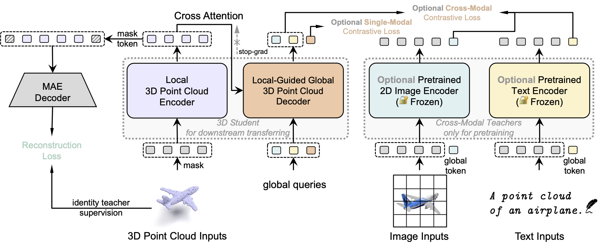

# Point-CMAE
### Baseline Methods: Bringing Masked Autoencoders Explicit Contrastive Properties for Point Cloud Self-Supervised Learning 

The official PyTorch Implementation of Point-CMAE

[Bin Ren <sup>1,2</sup>](https://amazingren.github.io/), [Guofeng Mei<sup>3</sup>](https://scholar.google.com/citations?user=VsmIGqsAAAAJ&hl=zh-CN), [Danda Pani Paudel<sup>4,5</sup>](https://people.ee.ethz.ch/~paudeld/), [Weijie Wang<sup>2,3</sup>](https://people.ee.ethz.ch/~paudeld/), [Yawei Li <sup>4</sup>](https://yaweili.bitbucket.io/), [Mengyuan Liu<sup>6</sup>](https://scholar.google.com/citations?user=woX_4AcAAAAJ&hl=zh-CN), [Rita Cucchiara<sup>7</sup>](https://scholar.google.com/citations?user=OM3sZEoAAAAJ&hl=en),[Luc Van Gool <sup>4,5</sup>](https://scholar.google.com/citations?user=TwMib_QAAAAJ&hl=en), and [Nicu Sebe <sup>2</sup>](https://scholar.google.com/citations?user=stFCYOAAAAAJ&hl=en) <br>

<sup>1</sup> University of Pisa, Italy, <br>
<sup>2</sup> University of Trento, Italy, <br>
<sup>3</sup> Fondazione Bruno Kessler, Italy, <br>
<sup>4</sup> ETH Zürich, Switzerland, <br>
<sup>5</sup> INSAIT Sofia University, Bulgaria, <br>
<sup>6</sup> Peking University, China, <br>
<sup>7</sup> University of Modena and Reggio Emilia, Italy, <br>


[](https://arxiv.org/pdf/2407.05862)


## Latest
- 📌 `09/24/2024`: We are organizing the codes, it will be released after ICCV submission.
- 🎉 `09/20/2024`: Our paper is accepted by 17th Asian Conference on Computer Vision (ACCV2024)!
- 📌 `07/18/2024`: Repository is created. Our code will be made publicly available upon acceptance. 


<div align="center">
  
</div>


## Method
<br>
<details>
  <summary>
  <font size="+1">Abstract</font>
  </summary>
    Contrastive learning (CL) for Vision Transformers (ViTs) in image domains has achieved performance comparable to CL for traditional convolutional backbones. However, in 3D point cloud pretraining with ViTs, masked autoencoder (MAE) modeling remains dominant. This raises the question: Can we take the best of both worlds? To answer this question, we first empirically validate that integrating MAE-based point cloud pre-training with the standard contrastive learning paradigm, even with meticulous design, can lead to a decrease in performance. To address this limitation, we reintroduce CL into the MAE-based point cloud pre-training paradigm by leveraging the inherent contrastive properties of MAE. Specifically, rather than relying on extensive data augmentation as commonly used in the image domain, we randomly mask the input tokens twice to generate contrastive input pairs. Subsequently, a weight-sharing encoder and two identically structured decoders are utilized to perform masked token reconstruction. Additionally, we propose that, for an input token masked by both masks simultaneously, the reconstructed features should be as similar as possible. This naturally establishes an explicit contrastive constraint within the generative MAE-based pre-training paradigm, resulting in our proposed Point-CMAE. Consequently, Point-CMAE effectively enhances the representation quality and transfer performance compared to its MAE counterpart. Experimental evaluations across various downstream applications, including classification, part segmentation, and few-shot learning, demonstrate the efficacy of our framework in surpassing state-of-the-art techniques under standard ViTs and single-modal settings. The source code and trained models are available 
</details>


## Pretrained Models
TBD

### 3D Object Detection
TBD

## Usage
TBD

### Requirements
- PyTorch >= 1.7.0
- python >= 3.7
- CUDA >= 9.0
- GCC >= 4.9 
- torchvision

```
# Create the virtual environment via micromamba or anaconda:
micromamba create -n point python=3.10 -y

# cuda
export LD_LIBRARY_PATH=/opt/modules/nvidia-cuda-11.8.0/lib64:$LD_LIBRARY_PATH
export PATH=/opt/modules/nvidia-cuda-11.8.0/bin:$PATH

# gcc
export PATH=/opt/modules/gcc-9.5.0/bin:$PATH

# Install PyTorch 2.0.1 + CUDA 11.8
pip install torch==2.0.1+cu118 torchvision==0.15.2+cu118 -f https://download.pytorch.org/whl/torch_stable.html

# Install Other libs
pip install -r requirements.txt

# Install pytorch3d from wheels (We use the chamfer distance loss within pytorch3d)
pip install --no-index --no-cache-dir pytorch3d -f https://dl.fbaipublicfiles.com/pytorch3d/packaging/wheels/py38_cu113_pyt1110/download.html


# Chamfer Distance:

```
cd ./extensions/chamfer_dist
python setup.py install --user
```
# Install PointNet++
pip install "git+https://github.com/erikwijmans/Pointnet2_PyTorch.git#egg=pointnet2_ops&subdirectory=pointnet2_ops_lib"
# Install GPU kNN
pip install --upgrade https://github.com/unlimblue/KNN_CUDA/releases/download/0.2/KNN_CUDA-0.2-py3-none-any.whl

```

### Dataset

For **ModelNet40**, **ScanObjectNN**, and **ShapeNetPart** datasets, we use **ShapeNet** for the pre-training of MaskPoint models, and then finetune on these datasets respectively.


The details of used datasets can be found in [DATASET.md](./DATASET.md).


### Point-CMAE pre-training
To pre-train the Point-CMAE models on ShapeNet, simply run:
```
python main.py --config cfgs/pretrain_shapenet.yaml \
    --exp_name pretrain_shapenet \
    [--val_freq 10]
```

### Fine-tuning on downstream tasks
We finetune our Point-CMAE on 5 downstream tasks: Classfication on ModelNet40, Few-shot learning on ModelNet40, Transfer learning on ScanObjectNN, Part segmentation on ShapeNetPart.

#### ModelNet40
To finetune a pre-trained Point-CMAE model on ModelNet40, simply run:
```
python main.py
    --config cfgs/finetune_modelnet.yaml \
    --finetune_model \
    --ckpts <path> \
    --exp_name <name>
```

To evaluate a model finetuned on ModelNet40, simply run:
```
bash ./scripts/test.sh <GPU_IDS>\
    --config cfgs/finetune_modelnet.yaml \
    --ckpts <path> \
    --exp_name <name>
```

#### Few-shot Learning on ModelNet40
We follow the few-shot setting in the previous work.

First, generate your own few-shot learning split or use the same split as us (see [DATASET.md](./DATASET.md)).

#### ScanObjectNN
To finetune a pre-trained Point-CMAE model on ScanObjectNN, simply run:
```
python main.py \
    --config cfgs/finetune_scanobject_hardest.yaml \
    --finetune_model \
    --ckpts <path> \
    --exp_name <name>
```

To evaluate a model on ScanObjectNN, simply run:
```
bash ./scripts/test_scan.sh <GPU_IDS>\
    --config cfgs/finetune_scanobject_hardest.yaml \
    --ckpts <path> \
    --exp_name <name>
```

#### ShapeNetPart
TBD

## Citation

If you find our work helpful, please consider citing the following paper and/or ⭐ the repo.
```
@inproceedings{ren2024bringing,
  title={Bringing masked autoencoders explicit contrastive properties for point cloud self-supervised learning},
  author={Ren, Bin and Mei, Guofeng and Paudel, Danda Pani and Wang, Weijie and Li, Yawei and Liu, Mengyuan and Cucchiara, Rita and Van Gool, Luc and Sebe, Nicu},
  booktitle={Proceedings of the Asian Conference on Computer Vision},
  pages={2034--2052},
  year={2024}
}
```

## Acknowledgements
Our code is built on the code base of [Point-MAE](https://github.com/Pang-Yatian/Point-MAE).